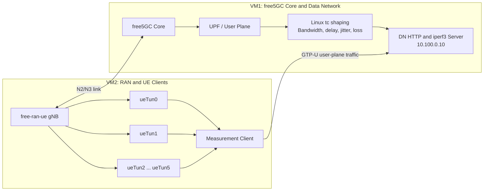

# free5GC Streaming Measurement Framework

This repository contains a two-VM measurement framework for evaluating file-based immersive media delivery through a free5GC user-plane deployment. It coordinates the free5GC Core and Data Network (DN) services on **VM1** with the gNB, multiple UEs, and client-side measurements on **VM2**.

The framework supports repeatable experiments with configurable bandwidth profiles, concurrent UE scenarios, HTTP file delivery, `iperf3`, ICMP ping, system monitoring, packet capture, JSON reporting, and analysis-ready CSV exports.

## Main Features

- Starts and coordinates the free5GC Core, DN HTTP server, and `iperf3` servers.
- Starts a free-ran-ue gNB and up to six UE instances.
- Evaluates `one`, `half`, and `all` concurrency scenarios.
- Applies bandwidth, delay, jitter, and packet-loss emulation with Linux `tc`.
- Measures TCP throughput, HTTP goodput, RTT, loss, optional UDP jitter, retransmissions, and interface statistics.
- Estimates startup delay, stalls, quality changes, and a simple QoE score.
- Calculates Jain's fairness index for throughput, HTTP goodput, and QoE.
- Captures traffic with `tcpdump` and exports detailed JSON and CSV results.

## Experimental Architecture



The Bash wrappers use the following default addressing and interfaces:

| Component | Default value |
|---|---|
| VM1 NAT interface | `enp0s3` |
| VM1 interface toward VM2 | `enp0s8` — `10.0.1.1/24` |
| VM2 NAT interface | `enp0s3` |
| VM2 interface toward VM1 | `enp0s8` — `10.0.1.2/24` |
| RAN interface | `ran0` — `10.0.3.1/24` |
| UE tunnel interfaces | `ueTun0` to `ueTun5` |
| UE tunnel addresses | `10.60.0.X/32` |
| DN server address | `10.100.0.10` |
| HTTP port | `8080` |
| `iperf3` ports | `5201` to `5206` |

Adapt these values to the interfaces and addresses used by your deployment.

## Repository Structure

Use canonical filenames without browser-added suffixes such as `(1)` or `(2)`:

```text
.
├── free5gc_vm1_core_dn_server_monitor_csv.py
├── free5gc_vm1_orchestrator.py
├── free5gc_vm2_ue_client_measure_csv.py
├── free5gc_vm2_orchestrator.py
├── run_vm1_1gbps.sh
├── run_vm2_final.sh
└── run_vm2_1gbps.sh
```

| File | Purpose |
|---|---|
| `free5gc_vm1_core_dn_server_monitor_csv.py` | Runs the DN HTTP server and `iperf3` servers, applies `tc`, monitors VM1 resources and interfaces, captures traffic, and exports JSON/CSV results. |
| `free5gc_vm1_orchestrator.py` | Starts the free5GC Core and executes the VM1 monitoring script for each bandwidth profile. |
| `free5gc_vm2_ue_client_measure_csv.py` | Runs ping, TCP/UDP `iperf3`, HTTP downloads, QoE estimation, fairness analysis, interface monitoring, packet capture, and JSON/CSV export. |
| `free5gc_vm2_orchestrator.py` | Generic Python orchestrator that can run the RAN setup script, gNB, individually configured UEs, and VM2 measurements. |
| `run_vm1_1gbps.sh` | VM1 wrapper configured for the concrete two-VM topology and the `1/10/100 Gbps` profiles. |
| `run_vm2_final.sh` | Recommended VM2 wrapper: starts the gNB once, registers six UEs once, and uses the first `1`, `3`, or `6` tunnels for each scenario. |
| `run_vm2_1gbps.sh` | Alternative VM2 wrapper that restarts the UE process for each concurrency scenario and uses manual synchronization by default. |

## Requirements

### VM1

- Linux with root or `sudo` access.
- A working free5GC installation.
- Python 3.8 or newer.
- `iperf3`.
- `tcpdump`.
- `iproute2`, including `ip` and `tc`.
- A directory containing the files or segments to be delivered.

### VM2

- Linux with root or `sudo` access.
- A working free-ran-ue build.
- Python 3.8 or newer.
- `curl`.
- `iperf3`.
- `ping` from `iputils-ping`.
- `tcpdump`.
- `iproute2`.
- Valid gNB and UE configuration files.

The Python scripts use only the Python standard library. No `pip` dependencies are required.

Example package installation on Ubuntu:

```bash
sudo apt update
sudo apt install -y python3 curl iperf3 iputils-ping tcpdump iproute2
```

## Preparation

### 1. Rename the scripts

The Python orchestrators expect canonical filenames. Rename downloaded copies when necessary:

```bash
mv 'free5gc_vm1_orchestrator(1).py' free5gc_vm1_orchestrator.py
mv 'free5gc_vm1_core_dn_server_monitor_csv(1).py' free5gc_vm1_core_dn_server_monitor_csv.py
mv 'free5gc_vm2_orchestrator(1).py' free5gc_vm2_orchestrator.py
mv 'free5gc_vm2_ue_client_measure_csv).py' free5gc_vm2_ue_client_measure_csv.py
mv 'run_vm1_1gbps(2).sh' run_vm1_1gbps.sh
mv 'run_vm2_final(2).sh' run_vm2_final.sh
mv 'run_vm2_1gbps(2).sh' run_vm2_1gbps.sh
```

Make the scripts executable:

```bash
chmod +x *.py *.sh
```

### 2. Prepare VM1

The default VM1 wrapper assumes:

```text
~/free5gc/                         free5GC installation
~/free5gc/reload_host_config.sh   host configuration helper
~/streaming_files/                files or segments to deliver
```

Review these variables in `run_vm1_1gbps.sh`:

```bash
CORE_DIR="$HOME/free5gc"
RELOAD_INTF="enp0s8"
BIND_IP="10.100.0.10"
HTTP_SRC_DIR="$HOME/streaming_files"
TC_SPEC="lo"
MONITOR_SPECS="lo,enp0s3,enp0s8"
TCPDUMP_SPECS="lo,enp0s3,enp0s8"
```

`TC_SPEC="lo"` is appropriate only when the DN server address and traffic path are associated with the loopback interface in the deployed topology. Replace it with the actual DN/N6 interface or an `interface@namespace` specification when required.

### 3. Prepare VM2

The recommended wrapper assumes:

```text
~/free-ran-ue/              free-ran-ue source and build
~/free-ran-ue/config/gnb.yaml
~/free-ran-ue/config/ue.yaml
~/free5gc_vm2_ue_client_measure_csv.py
```

Review these variables in `run_vm2_final.sh`:

```bash
RAN_DIR="$HOME/free-ran-ue"
CLIENT_SCRIPT="$HOME/free5gc_vm2_ue_client_measure_csv.py"
SERVER_IP="10.100.0.10"
RAN_INTF="enp0s8"
MAX_UES="6"
```

The wrapper intentionally **does not execute** `/usr/local/bin/setup-ran0.sh`. Create and configure `ran0` before launching the experiment.

## Default Experiment Profiles

The supplied wrappers evaluate:

| Profile label | Configured rate on VM1 |
|---|---:|
| `1gbps` | `1000 Mbit/s` |
| `10gbps` | `10000 Mbit/s` |
| `100gbps` | `100000 Mbit/s` |

Each profile also uses the following default `netem` parameters:

| Parameter | Value |
|---|---:|
| One-way configured delay | `2 ms` |
| Jitter | `0.2 ms` |
| Packet loss | `0.01%` |
| VM1 profile duration | `900 s` |
| Repetitions per VM2 scenario | `5` |
| Maximum files per transfer | `300` |

Concurrency scenarios in `run_vm2_final.sh` are implemented as follows:

| Scenario | Active UE tunnels |
|---|---|
| `one` | `ueTun0` |
| `half` | `ueTun0`, `ueTun1`, `ueTun2` |
| `all` | `ueTun0` through `ueTun5` |

All six UEs remain registered. Only the first `N` tunnels generate measurement and download traffic in each scenario.

## Running the Experiment

### Recommended workflow

Start VM1 first:

```bash
cd /path/to/repository
./run_vm1_1gbps.sh
```

Then start VM2 in a second terminal or machine:

```bash
cd /path/to/repository
./run_vm2_final.sh
```

The VM1 wrapper:

1. Reloads the configured free5GC host interface.
2. Starts the free5GC Core.
3. Runs one server/monitoring session for each bandwidth profile.
4. Starts the HTTP server and six `iperf3` server ports.
5. Applies `tc` shaping and captures traffic.
6. Exports VM1 JSON and CSV results.

The recommended VM2 wrapper:

1. Verifies the RAN directory and configuration files.
2. Starts the gNB if it is not already running.
3. Starts six UEs once and waits for `ueTun0` to `ueTun5`.
4. Checks HTTP reachability and UE ping stability.
5. Runs `one`, `half`, and `all` scenarios for every profile label.
6. Exports VM2 JSON, CSV, logs, and packet captures.

### Profile synchronization

Bandwidth shaping is performed only on VM1. VM2 profile names are labels and do not modify the network rate.

`run_vm2_final.sh` currently uses:

```bash
MANUAL_SYNC="0"
```

In this mode, VM2 waits for the HTTP manifest, but HTTP reachability alone does not verify that VM1 is using the matching bandwidth profile. For manually coordinated experiments, set:

```bash
MANUAL_SYNC="1"
```

and continue each VM2 profile only after VM1 has started the corresponding profile.

## Direct Script Usage

### VM1 server and monitoring script

```bash
sudo python3 free5gc_vm1_core_dn_server_monitor_csv.py \
  --experiment_id 1gbps_example \
  --bind_ip 10.100.0.10 \
  --http_src_dir "$HOME/streaming_files" \
  --http_port 8080 \
  --max_files 300 \
  --iperf_base_port 5201 \
  --iperf_servers 6 \
  --tc_spec lo \
  --bw_mbps 1000 \
  --delay_ms 2 \
  --jitter_ms 0.2 \
  --loss_pct 0.01 \
  --monitor_specs lo,enp0s3,enp0s8 \
  --tcpdump_specs lo,enp0s3,enp0s8 \
  --duration 900 \
  --out vm1_core_dn_1gbps_example.json \
  --csv_dir vm1_core_dn_1gbps_example_csv
```

Interface arguments also support Linux network namespaces:

```text
veth-dn@dn
```

This means interface `veth-dn` inside namespace `dn`.

### VM2 measurement script

```bash
sudo python3 free5gc_vm2_ue_client_measure_csv.py \
  --experiment_id 1gbps_all_example \
  --server_ip 10.100.0.10 \
  --http_port 8080 \
  --ue_ifaces ueTun0,ueTun1,ueTun2,ueTun3,ueTun4,ueTun5 \
  --clients 6 \
  --download_scenarios all \
  --runs 5 \
  --max_files 300 \
  --iperf_base_port 5201 \
  --iperf_sec 10 \
  --ping_count 20 \
  --monitor_ifaces ueTun0,ueTun1,ueTun2,ueTun3,ueTun4,ueTun5,enp0s8,ran0 \
  --tcpdump_ifaces ueTun0,ueTun1,ueTun2,ueTun3,ueTun4,ueTun5,enp0s8,ran0 \
  --out vm2_ue_1gbps_all_example.json \
  --csv_dir vm2_ue_1gbps_all_example_csv
```

Add `--udp` to run the optional UDP `iperf3` measurement.

## Measurement Sequence

For each logical client and repetition, the VM2 script performs:

1. ICMP ping through the assigned `ueTunX` interface.
2. TCP `iperf3` measurement.
3. Optional UDP `iperf3` measurement.
4. HTTP file downloads for active clients.

Clients are executed concurrently in separate threads. Active downloaders synchronize immediately before starting their HTTP transfers.

**RTT interpretation:** the reported ping RTT is a connectivity baseline collected before the HTTP download for that client. It is not an RTT trace collected continuously during file transfer. TCP sender RTT and RTT variation are also extracted from the final `iperf3` TCP report when available.

## HTTP Delivery and QoE Model

VM1 copies the selected source files into a temporary serving directory, sorts them, prefixes them with a numeric index, and generates `manifest.json`. VM2 retrieves this manifest through the first UE tunnel and downloads up to `max_files` sequentially for each active client.

The client records per-file `curl` values such as:

- HTTP status code.
- Downloaded bytes.
- DNS lookup time.
- TCP connection time.
- Time to first byte.
- Total download time.
- Download speed.

The included QoE model derives:

- Startup delay.
- Stall count.
- Total stall time.
- Quality switches.
- Average quality level.
- A simple composite QoE score.

This is a controlled analytical model based on download timing, playback rate, and initial-buffer assumptions. It should not be interpreted as direct telemetry from a production media player.

## Collected Metrics

| Category | Metrics |
|---|---|
| ICMP connectivity | RTT minimum, average, maximum, and `mdev`; packet loss; estimated jitter from RTT `mdev` |
| TCP network performance | Throughput, retransmissions, final sender congestion window, final RTT, and RTT variation from `iperf3` |
| UDP network performance | Throughput, jitter, lost packets, and loss percentage when `--udp` is enabled |
| HTTP delivery | Per-file bytes, total time, start-transfer time, speed, aggregate bytes, and HTTP goodput |
| QoE estimation | Startup delay, stall count, stall time, quality switches, average quality level, and simple QoE score |
| Fairness | Jain's index for TCP throughput, HTTP goodput, and QoE score |
| Host resources | CPU utilization, load average, memory information, and interface counters |
| Interfaces | RX/TX bytes, packets, errors, and drops before, during, and after each run |
| Packet traces | PCAP files for the configured VM1 and VM2 interfaces |

Aggregate VM2 statistics include the mean, population standard deviation, 95% confidence-interval half-width, and sample count across repetitions.

## Output Files

### VM1

Default directory:

```text
~/free5gc_results_vm1/
```

Typical files:

```text
vm1_core_dn_<profile>_<suffix>.json
vm1_core_dn_<profile>_<suffix>_csv/
pcap_vm1_<profile>_<suffix>/
work_vm1_<profile>_<suffix>/
```

VM1 CSV tables:

```text
vm1_summary.csv
vm1_http.csv
vm1_iperf_servers.csv
vm1_tc.csv
vm1_tcpdump.csv
vm1_interface_delta.csv
vm1_monitor_samples.csv
```

### VM2

Default directory:

```text
~/free5gc_results_vm2/
```

Typical files:

```text
vm2_ue_<profile>_<scenario>_<suffix>.json
vm2_ue_<profile>_<scenario>_<suffix>_csv/
```

VM2 CSV tables:

```text
vm2_aggregate_stats.csv
vm2_run_summary.csv
vm2_per_client_metrics.csv
vm2_http_segments.csv
vm2_interface_delta.csv
vm2_monitor_samples.csv
vm2_tcpdump.csv
```

RAN logs are written by default to:

```text
~/ran_logs/
```

Core logs are written by default to:

```text
~/free5gc_logs/
```

## Validation and Troubleshooting

Check that the required interfaces exist:

```bash
ip -br address
ip link show ran0
ip link show ueTun0
```

Verify user-plane connectivity from VM2:

```bash
ping -I ueTun0 10.100.0.10 -c 10
curl --interface ueTun0 http://10.100.0.10:8080/manifest.json
```

Verify services on VM1:

```bash
ss -lntp | grep 8080
ss -lntp | grep 520
curl http://10.100.0.10:8080/manifest.json
```

Inspect shaping configuration:

```bash
tc qdisc show dev lo
tc class show dev lo
```

Inspect logs:

```bash
tail -f ~/free5gc_logs/free5gc_core.log
tail -f ~/ran_logs/gnb.log
tail -f ~/ran_logs/ue_current.log
```

Common causes of failure include:

- `ran0` was not created before running the recommended VM2 wrapper.
- VM1 and VM2 use different N2/N3 interfaces or addresses.
- The DN server address is not reachable through `ueTunX`.
- The configured `tc` interface is not on the actual data path.
- The HTTP source directory is missing or empty.
- `iperf3`, `curl`, `ping`, or `tcpdump` is unavailable.
- VM1 and VM2 are running different profile labels at the same time.
- A previous gNB, UE, HTTP server, `iperf3`, or `tc` process/configuration remains active.

## Cleanup

Stop UE processes and remove stale UE tunnels when necessary:

```bash
sudo pkill -TERM -f "free-ran-ue ue" || true
sudo pkill -KILL -f "free-ran-ue ue" || true
```

Stop the gNB:

```bash
sudo pkill -f "free-ran-ue gnb" || true
```

Stop free5GC processes according to the deployment's normal shutdown procedure.

Remove the shaping rule manually if it was not cleared automatically:

```bash
sudo tc qdisc del dev lo root 2>/dev/null || true
```

## Reproducibility Notes

- Keep VM1 and VM2 system clocks synchronized when comparing timestamps.
- Record the free5GC and free-ran-ue versions or commits used in each experiment.
- Preserve the gNB, UE, AMF, SMF, UPF, routing, and host-interface configurations.
- Use the same source-file set and ordering across compared experiments.
- Keep the same number of repetitions, selected UE tunnels, buffer assumptions, and traffic profiles.
- Store the generated JSON, CSV, logs, and PCAP files together with the experiment configuration.
- Treat the `1/10/100 Gbps` values as configured shaping profiles; the achieved application throughput can be lower because of protocol, host, virtualization, server, and user-plane processing constraints.
